# Arenix - Gaming Demand Forecasting & Analytics Platform

Arenix is a Flask-based machine learning web application built to forecast gaming demand and analyze player activity trends. The project uses historical game data, Steam-related context, predictive modeling, and interactive dashboard pages to help understand demand patterns in the gaming market.

## Project Overview

The gaming industry changes quickly, with player interest shifting based on trends, releases, pricing, popularity, engagement, and player activity. Arenix focuses on using data analytics and machine learning to identify demand patterns and present useful insights through a clean web dashboard.

This project combines data preprocessing, model training, prediction logic, visual analytics, model evaluation, and a Flask frontend into one end-to-end application.

## Key Features

- Gaming demand forecasting using machine learning
- Flask-based web dashboard
- Steam data collection and snapshot scripts
- Live training data preparation
- Model training and validation workflow
- Game catalog support
- Demand comparison page
- Dashboard and analytics pages
- Model evaluation report
- Saved trained ML model
- Responsive HTML/CSS frontend
- Dashboard screenshots included
- Basic automated tests using Pytest
- Deployment-ready files for Render

## Tech Stack

- Python
- Flask
- Pandas
- Scikit-learn
- HTML
- CSS
- Pytest
- Render
- Steam API / Steam data context
- Machine Learning
- Data Visualization

## Dashboard Preview

### Main Dashboard

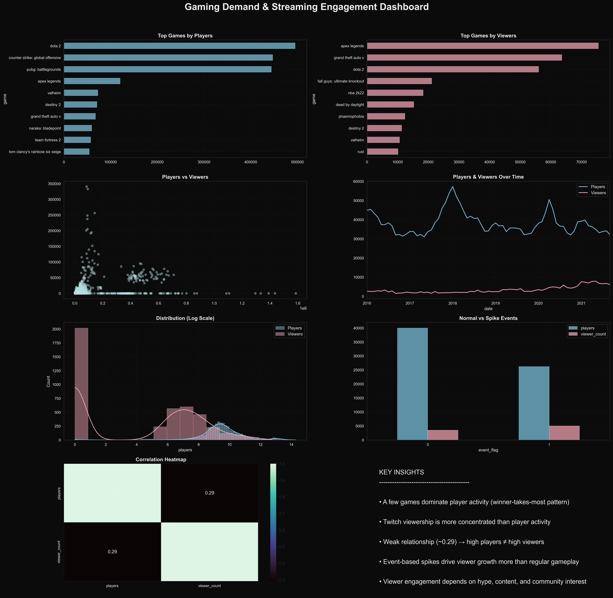

### ML Evaluation Dashboard

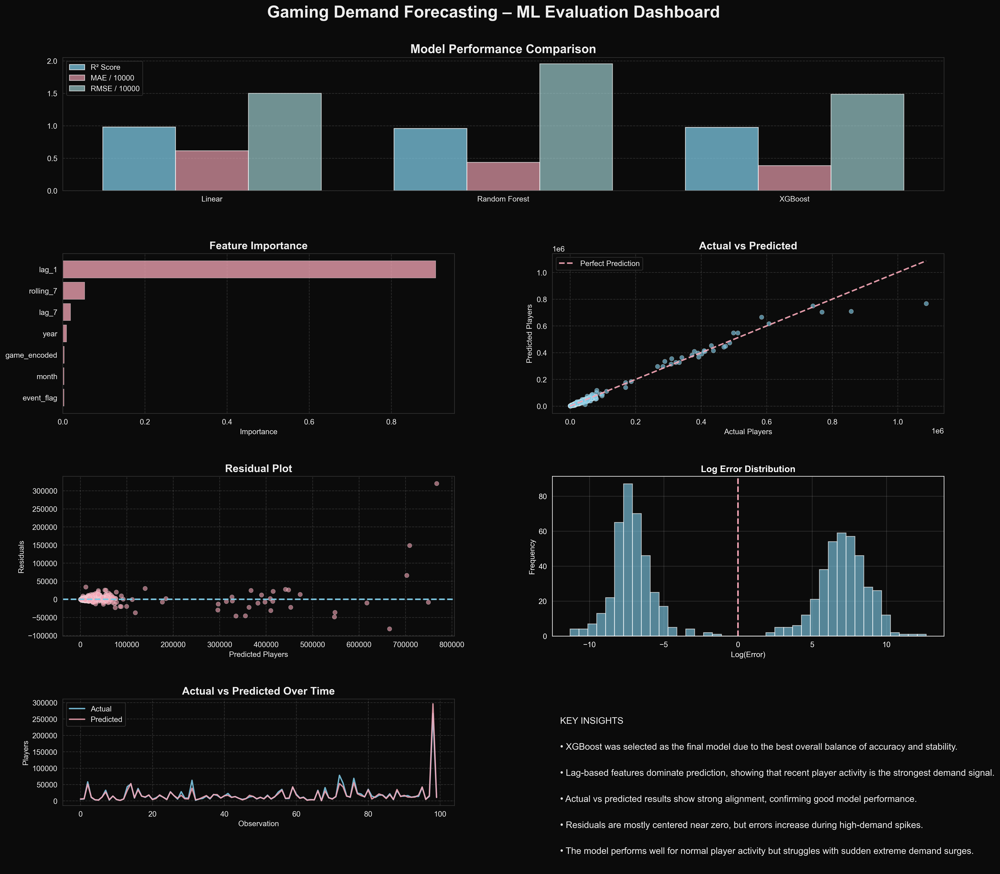

## Application Screenshots

### Screenshot 1

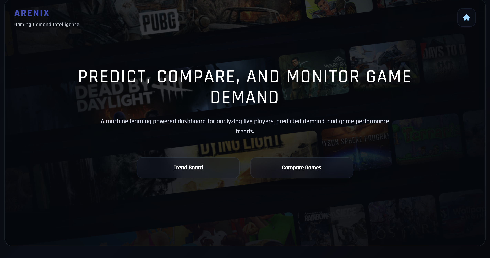

### Screenshot 2

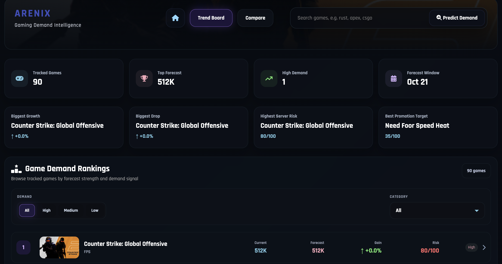

### Screenshot 3

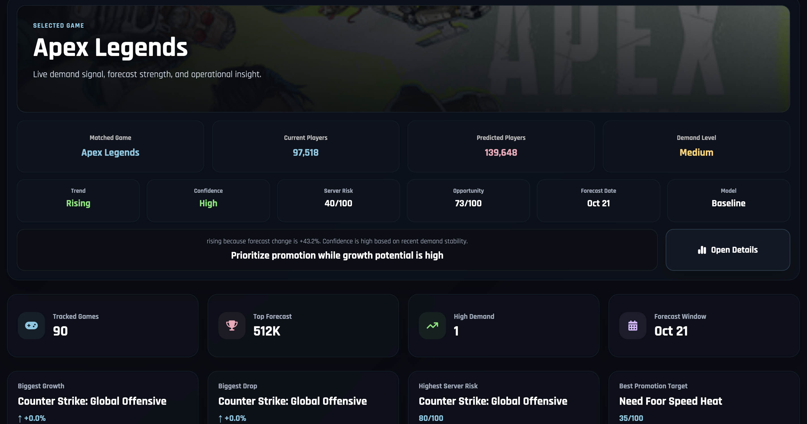

### Screenshot 4

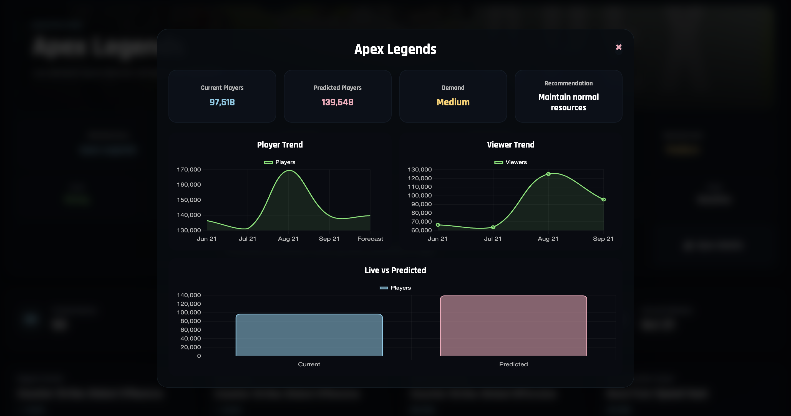

### Screenshot 5

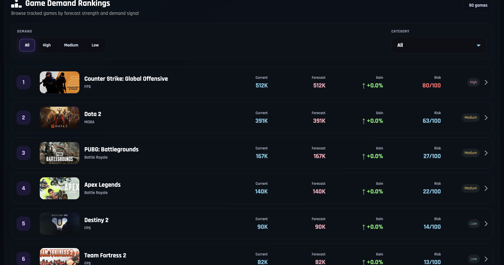

### Screenshot 6

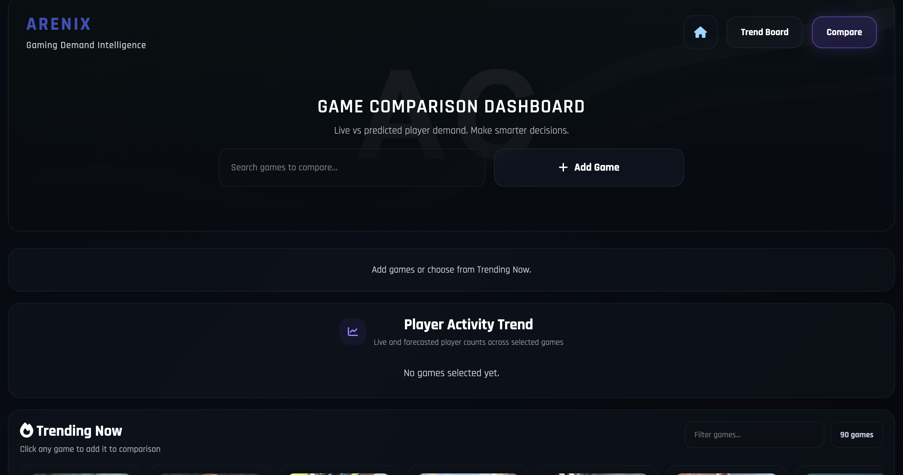

### Screenshot 7

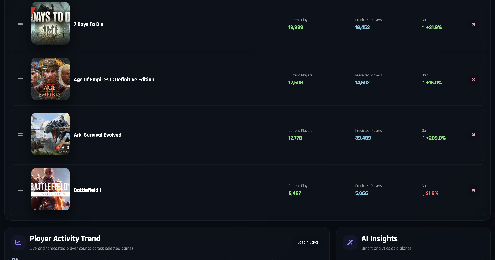

### Screenshot 8

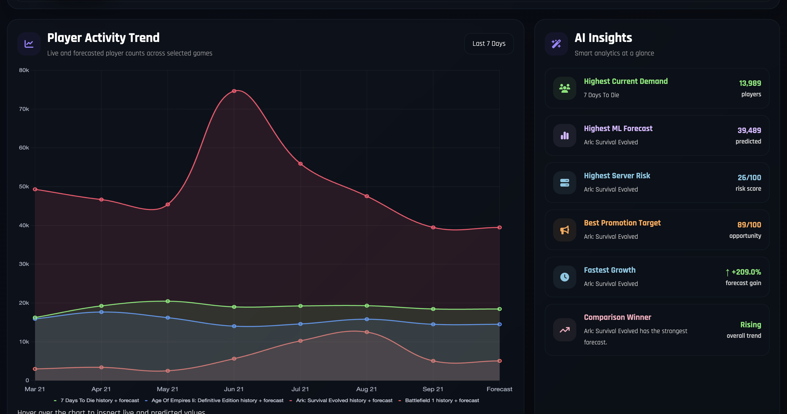

### Screenshot 9

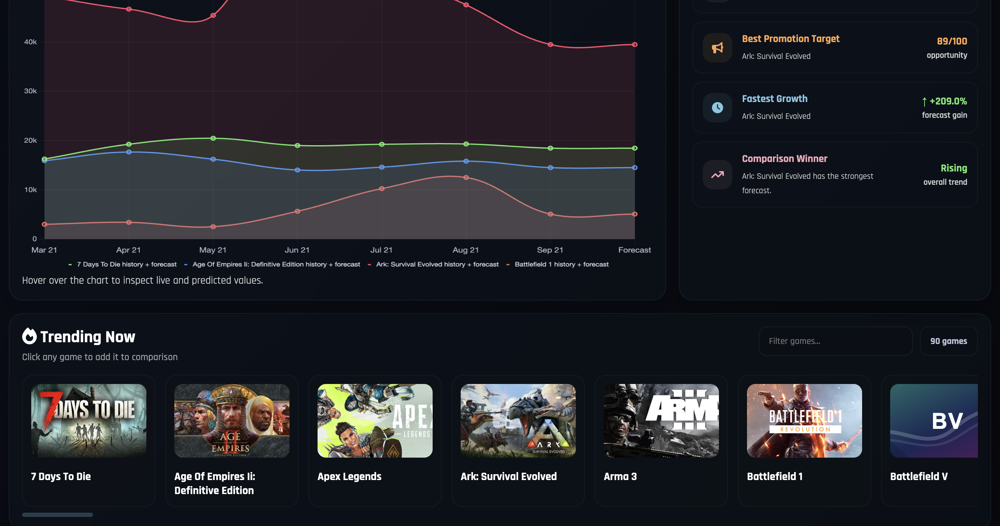

## Project Structure

```text
Arenix/
├── app.py
├── demand_model.py
├── train_model.py
├── validate_model_report.py
├── build_live_training_data.py
├── collect_steam_snapshots.py
├── run_daily_pipeline.py
├── game_catalog.py
├── model_data.csv
├── gaming_dashboard_updated.png
├── ml_evaluation_dashboard.png
├── requirements.txt
├── Procfile
├── render.yaml
├── runtime.txt
├── pytest.ini
├── README.md
│
├── model/
│   ├── final_demand_model.pkl
│   └── training_report.json
│
├── static/
│   └── style.css
│
├── templates/
│   ├── home.html
│   ├── dashboard.html
│   └── compare.html
│
├── tests/
│   ├── test_app.py
│   └── test_live_training_data.py
│
├── arenix_screenshot_01.png
├── arenix_screenshot_02.png
├── arenix_screenshot_03.png
├── arenix_screenshot_04.png
├── arenix_screenshot_05.png
├── arenix_screenshot_06.png
├── arenix_screenshot_07.png
├── arenix_screenshot_08.png
└── arenix_screenshot_09.png
```

## Main Files

| File | Purpose |
|---|---|
| `app.py` | Main Flask application file |
| `demand_model.py` | Demand prediction and model logic |
| `train_model.py` | Script for training the ML model |
| `validate_model_report.py` | Validates model performance report |
| `build_live_training_data.py` | Prepares live-style training data |
| `collect_steam_snapshots.py` | Collects Steam-related game snapshots |
| `run_daily_pipeline.py` | Runs the data and model pipeline |
| `game_catalog.py` | Stores or manages game catalog data |
| `model_data.csv` | Dataset used for model training and analysis |
| `gaming_dashboard_updated.png` | Dashboard preview image |
| `ml_evaluation_dashboard.png` | ML evaluation dashboard image |
| `requirements.txt` | Python dependencies |
| `Procfile` | Deployment process file |
| `render.yaml` | Render deployment configuration |
| `runtime.txt` | Python runtime version |
| `pytest.ini` | Pytest configuration |

## Machine Learning Workflow

The project follows an end-to-end ML workflow:

1. Collect or prepare gaming-related data
2. Clean and process the dataset
3. Build live-style training data
4. Train the demand forecasting model
5. Save the final trained model
6. Generate a training report
7. Validate the model report
8. Use the model inside the Flask dashboard
9. Display predictions, comparisons, and insights through frontend pages

## Web Application Pages

The application includes multiple frontend pages:

- `home.html` - Landing/home page for the application
- `dashboard.html` - Main analytics dashboard
- `compare.html` - Game comparison and demand insight page

## Model Artifacts

The trained model and report are stored in the `model/` folder:

```text
model/
├── final_demand_model.pkl
└── training_report.json
```

- `final_demand_model.pkl` stores the trained ML model.
- `training_report.json` stores model training and evaluation results.

## How To Run Locally

1. Clone the repository:

```bash
git clone https://github.com/Sagnik0910/Arenix.git
cd Arenix
```

2. Install dependencies:

```bash
pip install -r requirements.txt
```

3. Run the Flask application:

```bash
python app.py
```

4. Open the app in your browser:

```text
http://127.0.0.1:5000
```

## Running The ML Pipeline

To train or update the model, run:

```bash
python train_model.py
```

To build live training data:

```bash
python build_live_training_data.py
```

To collect Steam snapshots:

```bash
python collect_steam_snapshots.py
```

To run the daily pipeline:

```bash
python run_daily_pipeline.py
```

To validate the model report:

```bash
python validate_model_report.py
```

## Testing

Run tests using:

```bash
pytest
```

The test files check core application behavior and live training data functionality.

## Deployment

The project includes deployment files for Render:

- `Procfile`
- `render.yaml`
- `runtime.txt`

These files help deploy the Flask application as a web service.

## Business Use Case

Arenix can be useful for:

- Understanding gaming demand trends
- Comparing player interest between games
- Forecasting future demand
- Supporting game market analysis
- Building portfolio-level analytics dashboards
- Demonstrating ML deployment with Flask

## Future Improvements

- Add more real-time Steam API integrations
- Improve model accuracy with larger datasets
- Add user authentication
- Add more interactive charts
- Include advanced game comparison filters
- Add SQL database support for historical tracking
- Deploy the live dashboard publicly
- Add API endpoints for predictions
- Improve UI responsiveness across all screen sizes

## Author

**Sagnik Guha**

GitHub: [Sagnik0910](https://github.com/Sagnik0910)

## License

This project is created for learning, portfolio building, and data analytics practice.
